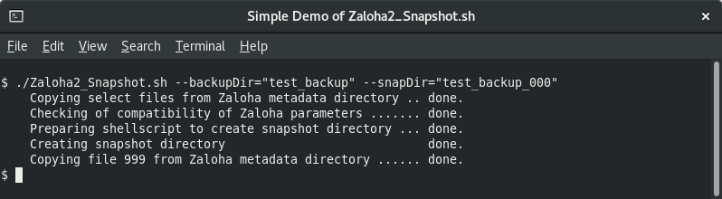

# Zaloha2_Snapshot.sh

Zaloha2_Snapshot is an add-on script to [Zaloha2](https://github.com/Fitus/Zaloha2.sh) to create hardlink-based snapshots
of the backup directory *(condition: hardlinks must be supported by the underlying filesystem type)*.

This allows to create **Time&nbsp;Machine**-like backup solutions.

On Linux/Unics, Zaloha2_Snapshot runs natively. On Windows, Cygwin is needed.

## Documentation

Documentation is available both [online](DOCUMENTATION.md) as well as inside of Zaloha2_Snapshot.sh.

Zaloha2_Snapshot has been created using the same technology and style as [Zaloha2](https://github.com/Fitus/Zaloha2.sh)
itself. Read [Zaloha2 documentation](https://github.com/Fitus/Zaloha2.sh/blob/master/DOCUMENTATION.md) to get acquainted
with relevant terminology, features, cautions and limitations.

## Obtain Zaloha2_Snapshot.sh

The simplest way: Under the green button "<b>Code</b>" above, choose "<b>Download ZIP</b>".
From the downloaded ZIP archive, extract <code>Zaloha2_Snapshot.sh</code> and
make it executable (<code>chmod u+x Zaloha2_Snapshot.sh</code>).

For running the Simple Demo, extract also the scripts <code>Simple_Demo_step1/2/3/4/5/6.sh</code> and make them executable.

The integrity of Zaloha2_Snapshot.sh can be verified by its SHA-256 hash. The hash of current version is:

```bash
sha256sum Zaloha2_Snapshot.sh
305412a96bd33ecdc9281658b5ba1a5806eef679eb8f4514410ad27360a69376  Zaloha2_Snapshot.sh
```

## Usage Example

```bash
Zaloha2_Snapshot.sh --backupDir="test_backup" --snapDir="test_backup_000"
```

## Usage Screenshot


## License
MIT License

